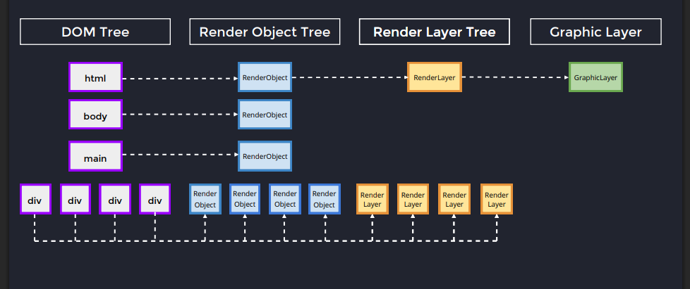
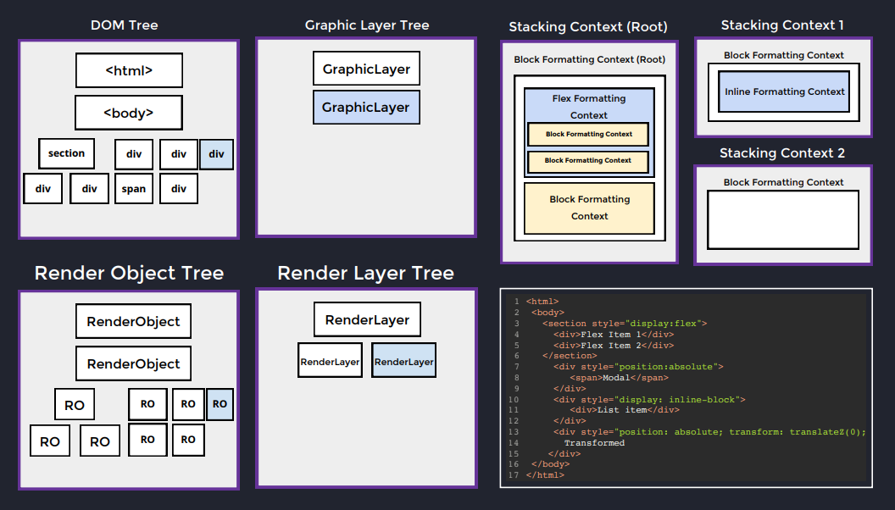

Slides : https://static.frontendmasters.com/resources/2024-05-29-systems-design/frontend-system-design-fundamentals.pdf

Process

1. Render Object created for every DOM element.
2. Render Layer Created when using properties like Position: Absolute/Relative. Each layer is stacked upon one another. It introduces the z-index and Prevents reflows.
3. Graphic Layer: Consumes GPU memory. Separate layer created when using css transform properties.

General Rule
PRIORITIZE CPU >>> GPU.
i.e. try to minimize reflows as they can block the rendering thread which uses CPU

