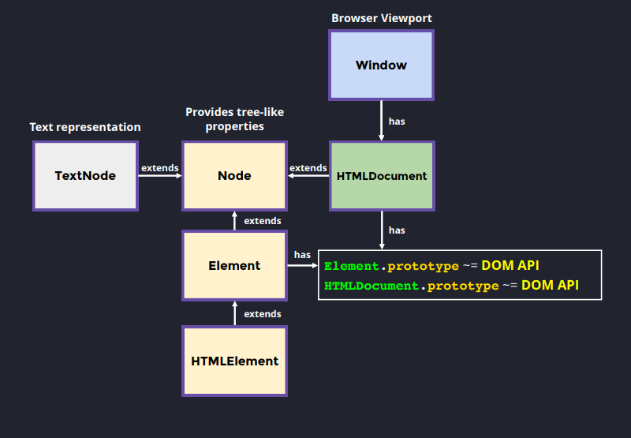
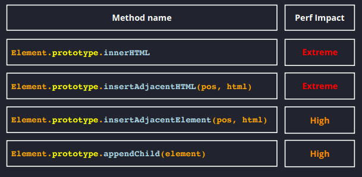

Everything is extended from a node object, which creates a tree-like structure.

### Query Selectors
1. GetElementById -> Best Performance (Browser builds an index).
2. GetElementByClassName/GetElementByTagName -> Low-Memory, High Read Access (Provides Live Elements)
3. QuerySelector -> Slightly worse than getElementById, but comparative performance (Depends on the Selector. Provides non-Live Elements).
4. QuerySelectorAll -> High-Memory, Cheap Read Access (Provides non-Live Elements).

NOTE: Most cases should we covered by querySelector and querySelectorAll. GetElementByClassName should only be used when you need to work with live nodes and in that case make sure you are working with less data.

Best Practice: Try to get the right container through the id and then you can query that container for your needs.

Adding New Elements Impact.
