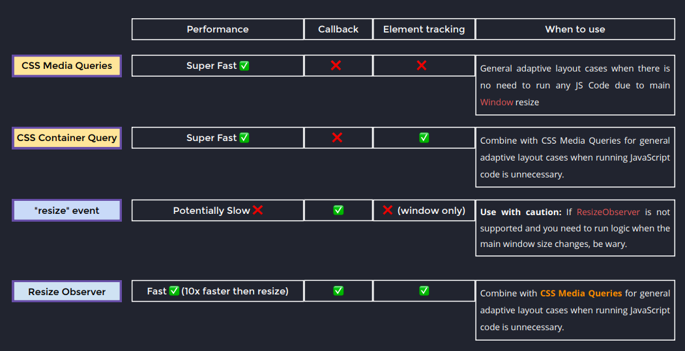

### Intersection Observer

```javascript
const intersectionObserver = new IntersectionObserver(
  (entries) => {
    entries.forEach((entry) => {
      //code
    });
  },
  { threshold: 0.1, root: rootElement },
);
intersectionObserver.observe(targetElement);
```

### Mutation Observer

```javascript
const mutationObserver = new MutationObserver((mutations) => {
  mutations.forEach((mutation) => {
    if (mutation.type === "** MUTATION TYPE **") {
      //code
    }
  });
});
mutationObserver.observe(targetElement, {
  characterData: true,
  subtree: true,
  //Etc.
});
```

### Resize Observer



```javascript
const resizeObserver = new ResizeObserver((entries) => {
  entries.forEach((entry) => {
    //Code
  });
});
resizeObserver.observe(targetElement);
```
